# Crypto Exchange Architecture

This document provides an overview of the architecture for a crypto exchange platform. The architecture is designed to be scalable, secure, and highly available, leveraging various AWS services and Cloudflare for content delivery and security.

## Architecture Components

### Cloudflare
- **Content Delivery Network (CDN)**: Distributes content to users with high availability and performance.
- **Web Application Firewall (WAF)**: Protects the web application from common web exploits.

### AWS
- **Web Application (Frontend)**: The user interface of the exchange, hosted on AWS, possibly with some SSR.
- **API Gateway**: Manages and routes API requests to backend services.
- **Backend Services (Auto Scaling Group)**: Scalable backend services that handle business logic.
- **Order Matching Engine**: Core component that matches buy and sell orders.
- **User Data (RDS)**: Relational database for storing user information.
- **Transaction Data (DynamoDB)**: NoSQL database for storing transaction records.
- **Order Queue (SQS)**: Queue service for managing order processing.
- **Wallet Service (Lambda Functions)**: Manages user wallets and interactions with blockchain nodes.
- **Blockchain Nodes (EC2 Instances)**: Nodes that interact with various blockchains.
- **Event Listener (Lambda Function)**: Listens for blockchain events and triggers necessary actions.
- **Event Stream (Amazon Kinesis)**: Stream processing service for handling event data.
- **Data Processor (Lambda Function)**: Processes event data and updates indexed data store.
- **Indexed Data Store (DynamoDB)**: NoSQL database for storing indexed data for quick retrieval.
- **Search Interface (OpenSearch Service)**: Provides search capabilities over indexed data.
- **Monitoring & Logging (CloudWatch)**: Monitors and logs application performance and issues.
- **Security Services (IAM, KMS)**: Manages identity, access, and encryption keys.
- **VPC and Subnets**: Virtual Private Cloud (VPC) and subnets for network isolation and segmentation.

## Data Flow

1. **User Interaction**: Users interact with the web application through the CDN and WAF.
2. **API Requests**: The web application sends API requests to the API Gateway.
3. **Backend Processing**: The API Gateway routes requests to backend services, which handle business logic and interact with the order matching engine.
4. **Order Management**: Orders are placed in the order queue and processed by the order matching engine.
5. **Data Storage**: User data is stored in RDS, while transaction data is stored in DynamoDB.
6. **Wallet Management**: The wallet service manages user wallets and interacts with blockchain nodes.
7. **Event Handling**: Blockchain events are captured by the event listener and processed through the event stream.
8. **Data Processing**: The data processor updates the indexed data store, which is used by the search interface.
9. **Monitoring and Security**: All components are monitored and logged using CloudWatch, with security managed by IAM and KMS.

## Service Paths

- **Web Application (Frontend)**: `https://www.domain.com`
- **API Gateway**: `https://api.domain.com`
- **Wallet Service**: `https://wallet-service.domain.com`
- **Search Interface**: `https://search.domain.com`

## Diagram

## Terraform

There is a Terraform configuration in the `terraform` directory that can be used to provision the necessary AWS resources for this architecture.

## Kubernetes

For a containerized version of this architecture, consider using Kubernetes with AWS EKS or another managed Kubernetes service, the `k8s` directory contains example configurations.